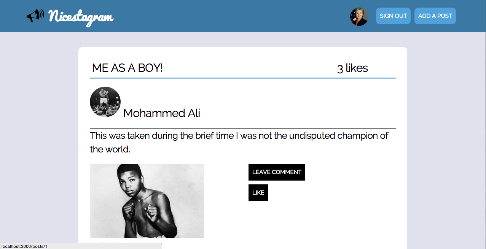

 

Instagram Challenge
===================

## Tech used

Ruby, Rails (Devise, Omniauth, Active Record), Rspec, Capybara, AJAX, SASS

## Lessons learned

I felt pleased that I was able to complete this challenge successfully. The result felt more like a 'proper' web app as there is a proper user verification with Devise, Facebook login, commenting on posts and even 'likes'. I'd like to use Angular to create filters for search functionality as well. 

Instagram Challenge
===================

## Tech used

Ruby, Rails (Devise, Omniauth, Active Record), Rspec, Capybara, AJAX, SASS

## Lessons learned

I felt pleased that I was able to complete this challenge successfully. The result felt more like a 'proper' web app as there is a proper user verification with Devise, Facebook login, commenting on posts and even 'likes'. I'd like to use Angular to create filters for search functionality as well. 

## Screenshot

Instructions
-------
* Challenge time: Friday, the entire day + the weekend if you need it
* Feel free to use google, your notes, books, etc but work on your own
* You must submit a pull request to this repo with your challenge solution (or partial solution) by 9am Monday morning

Task
-----

Build Instagram: Simple huh!

As usual please start by

* Filling out your learning plan self review for the week: https://github.com/makersacademy/learning_plan (if you haven't already)
* Forking this repo

Your challenge is to build Instagram using Rails. You'll need users who can post pictures, write comments on pictures and like a picture. It will need to look like the instagrams website or better. 

Breakdown of models:
- User
- Post
- Comment/description
- Like

Bonus if you can add filters :P 

Instructions
-------
* Challenge time: Friday, the entire day + the weekend if you need it
* Feel free to use google, your notes, books, etc but work on your own
* You must submit a pull request to this repo with your challenge solution (or partial solution) by 9am Monday morning

Task
-----

Build Instagram: Simple huh!

As usual please start by

* Filling out your learning plan self review for the week: https://github.com/makersacademy/learning_plan (if you haven't already)
* Forking this repo

Your challenge is to build Instagram using Rails. You'll need users who can post pictures, write comments on pictures and like a picture. It will need to look like the instagrams website or better. 

Breakdown of models:
- User
- Post
- Comment/description
- Like

Bonus if you can add filters :P 
